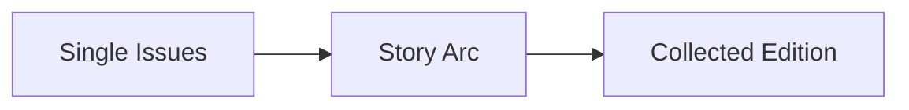

# 📚 Comics App 🚀

A one-stop platform designed for comic book readers and collectors. Whether you are a casual reader, a seasoned collector, or someone looking to trade and connect with the comic book community, we've got you covered! 💥

---

## 🎯 **Objective:**

There is currently no service curated specifically for comic book readers and collectors to:

- 📋 **Manage their collection**
- 🔄 **Trade with other collectors**
- 💸 **Track market prices & seller trends**
- 📢 **Get group discounts**

We aim to fill this gap by delivering a **comprehensive inventory and community experience** for comic book lovers.

---

## 🧩 **Comic Book Anatomy:**

**🧪 Atoms:** Single Issues (20-25 pages, like book chapters)

### 📖 **Story Structures:**

#### 📚 Collected Edition Types:

- **Paperback:** 6-8 issues
- **Hardcover Deluxe:** 6-10 issues
- **Omnibus:** Hardcover (600-1200 pages)
- **Compendium:** Softcover (500-1000 pages)

### 🎭 **Story Breakdown:**

- **Events:** Cross-title collections (e.g., DC Comics - New 52, Rebirth)
- **Runs:** Author-specific series (e.g., Tom King’s Batman)
- **Miniseries / One-shots:** Self-contained stories

### 🎨 **Special Elements:**

- **Variant Covers:** Unique cover art for the same issue
- **Crossovers:** Story arcs that span across multiple titles
- **Digital Formats:** CBR/CBZ file extensions for digital comics

---

## ✨ **Features:**

### 📋 **Collection & Inventory Management:**

- Categorize by **format:** Single Issues, Deluxe, Omnibus, etc.
- List comics by **writers, events, and chronology**

### 📊 **Track & Organize Your Reads:**

- 📖 **Reading Status:** Read / Reading / To-Read
- 📚 **Collection Status:** Collected / Want to Buy / Not Interested (Format-specific)

### 🛒 **Wishlist & Price Tracking:**

- Automatically populate your **Wishlist** with "Want to Buy" books
- Track **last purchase price** and **general market prices**

### 🔍 **Powerful Search Bar:**

Search any field—title, writer, event, format, or status—and easily navigate deeper!

### 📈 **Rank & Rate:**

- **Run-Level Ranking:** Rate comic runs
- Add **Bookmarks** for reading
- Track **prices on owned editions**

### 📥 **CBR Download Shortcut:**

- Direct link to **GetComics** for free CBR downloads

---

## 🛠️ **How to Use:**

1️⃣ Clone this repository  
2️⃣ Run the setup command  
3️⃣ Enjoy managing your comic collection like never before 🎉

---

## 💡 **Coming Soon:**

- Community trading platform ⚡
- Personalized recommendations 🤓
- AI-powered price analysis 📊

---

## ❤️ **Join the Community:**

We would love your contributions, ideas, and feedback! Let's build the ultimate Comics App together.

🔗 Check it out and star ⭐ the repo if you love comics as much as we do! 🎉
